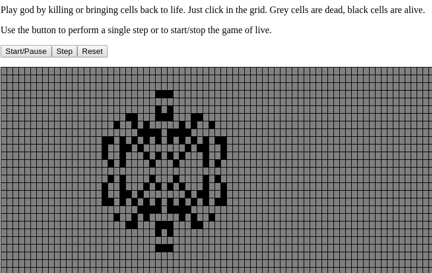

# Elm of Life

Game of Life written in Elm.
[Try Now !](https://philib.github.io/elm-of-life/)



This just a side project to get to know Elm.


## Installation

- Clone the project and run:
    ```$xslt
    elm reactor
    ```
- Open your Browser and go to `localhost:8000`

